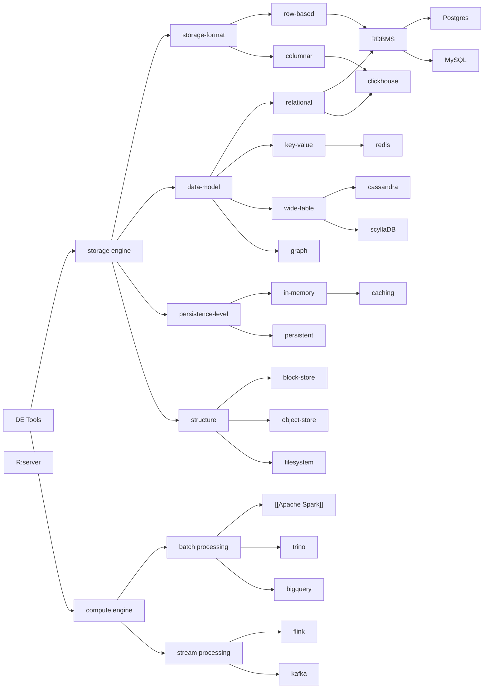

Welcome! I’m excited to share this space with you—a place where ideas bloom, knowledge grows, and curiosity thrives. This Knowledge Garden is more than just a collection of information; it’s a living, breathing ecosystem where I cultivate and nurture my thoughts, experiences, and learnings.
## Conceptual
- [[How to Think about Many Tools in Data Engineering Space]]
- [[Different Kind of Latency Requirements]]
## References
- [[Different Kind of Data Sources]]
- [[Different of Roles or Specializations]]
- [[List of Tools]]
- [[List of Tools Categories]]

